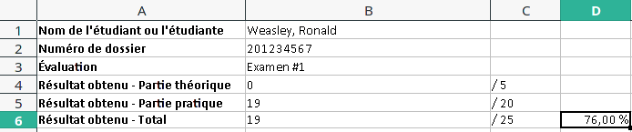

# Script d'extraction de notes pour importation dans Omnivox

Ce script s'adresse aux enseignant.e.s des cégeps utilisant Omnivox. Il permet d'extraire les notes pour une évaluation à partir d'un ensemble de fichiers Excel et de les regrouper dans un fichier CSV pouvant être importé directement dans Omnivox.

## Prérequis

Pour utiliser ce script, vous devez avoir un fichier Excel par étudiant ou étudiante. Ce fichier Excel doit avoir l'extension `.xlsx` et doit contenir, **sur sa dernière feuille**:

* Le nom de l'étudiant ou l'étudiante à la colonne **B1**
* Le numéro de dossier de l'étudiant ou l'étudiante à la colonne **B2**
* Le numérateur du résultat obtenu par l'étudiant ou l'étudiante à la **deuxième colonne** de la **dernière ligne**

Voici un exemple de formattage valide:



## Installation

L'installation et l'utilisation de ce script nécessitent:

* [Git](https://git-scm.com/)
* [Node.js](https://nodejs.org/en/) version 14 ou ultérieure
* [Yarn](https://yarnpkg.com/) (peut être installé via la commande `npm install -g yarn` après avoir installé Node)

En ligne de commande, positionnez-vous à l'emplacement de votre choix, puis exécutez la commande suivante pour télécharger le script:

```bash
git clone https://github.com/plbrault/script-extraction-notes-omnivox.git
```

Un sous-répertoire `script-extraction-notes-omnivox` sera créé dans le répertoire courant.

Positionnez-vous dans ce répertoire, puis exécutez la commande `yarn`.

## Utilisation

Positionnez-vous dans le répertoire `script-extraction-notes-omnivox` créé lors de l'installation.

Exécutez la commande `yarn extract EMPLACEMENT` en remplaçant `EMPLACEMENT` par l'emplacement du répertoire contenant vos fichiers Excel (qui peuvent être situés dans des sous-répertoires).

Le script s'exécutera et créera un fichier `omnivox.csv` dans son répertoire d'installation.

Ouvrez ce fichier avec Excel ou LibreOffice Calc, puis copiez son contenu. Vous pourrez ensuite le coller à l'endroit prévu à cet effet sur Omnivox afin d'y importer les notes.

***Ce script a seulement été testé dans un environnement UNIX, mais devrait en principe fonctionner sur Windows également. Merci de m'aviser si ce n'est pas le cas.***


## Licence

(Ce programme est distribué sous licence libre GPL)

Copyright (c) 2021 Pier-Luc Brault <pier-luc@brault.me>

This program is free software: you can redistribute it and/or modify
it under the terms of the GNU General Public License as published by
the Free Software Foundation, either version 3 of the License, or
(at your option) any later version.

This program is distributed in the hope that it will be useful,
but WITHOUT ANY WARRANTY; without even the implied warranty of
MERCHANTABILITY or FITNESS FOR A PARTICULAR PURPOSE.  See the
GNU General Public License for more details.

You should have received a copy of the GNU General Public License
along with this program.  If not, see <https://www.gnu.org/licenses/>.